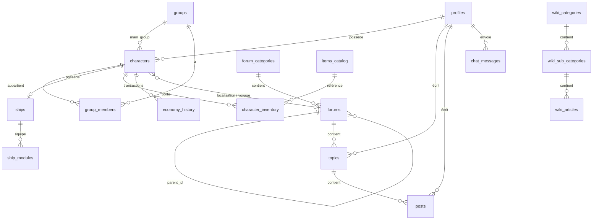

# Modèle de données Swor

Documentation métier du schéma Postgres. Complète le DDL SQL (source technique) par les règles, relations et choix de conception.

**Source canonique :** `api/database/migrations/` (migrations Laravel)  
**Seeds de contenu :** `api/database/seeders/`

## Vue d'ensemble

17 tables réparties en 7 domaines. Les règles du jeu (`front/src/features/rules/data/rules-data.ts`) restent **hors base** pour l'instant (contenu statique).



## Inventaire des tables

| Domaine | Tables | Doc |
|---------|--------|-----|
| Auth & comptes | `profiles` (+ `users` Laravel à venir) | `auth.md` *(à rédiger)* |
| Forum RP | `forum_categories`, `forums`, `topics`, `posts` | [forum.md](forum.md) |
| Personnages | `characters` | `characters.md` *(à rédiger)* |
| Factions | `groups`, `group_members` | `factions.md` *(à rédiger)* |
| Économie | `items_catalog`, `character_inventory`, `economy_history`, `ships`, `ship_modules` | `economy.md` *(à rédiger)* |
| Univers / wiki | `wiki_categories`, `wiki_sub_categories`, `wiki_articles` | `wiki.md` *(à rédiger)* |
| Chat | `chat_messages` | `chat.md` *(à rédiger)* |

## Enums Postgres

| Enum | Valeurs | Usage |
|------|---------|-------|
| `user_role` | `user`, `moderator`, `admin`, `game_master` | Profils, accès forums |
| `forum_type` | `category`, `region`, `sector`, `planet`, `location`, `forum` | Nœuds de l'arbre forum |
| `item_type` | `weapon`, `armor`, `consumable`, `tool`, `misc` | Catalogue items |
| `item_rarity` | `common` … `legendary` | Catalogue items |
| `economy_type` | `income`, `expense` | Historique crédits |
| `ship_module_type` | `engine`, `shield`, `weapon`, `utility` | Modules vaisseau |
| `ship_module_status` | `active`, `damaged`, `offline` | Modules vaisseau |

> **Note historique.** Avant la migration Laravel (#41), deux schémas SQL
> coexistaient (migrations Supabase CLI vs bootstrap Docker) ; le schéma Docker,
> plus complet (`group_members`, champs RP des personnages, `groups.era`,
> compteurs forum récursifs, RPC stats/vues), a servi de référence pour les
> migrations Laravel. Ces fichiers SQL ont été supprimés du repo — l'historique
> git et l'[ADR 0001](../adr/0001-migration-laravel.md) en gardent la trace.

## Contenu hors base

| Donnée | Emplacement actuel | Migration prévue |
|--------|-------------------|------------------|
| Règles du jeu | `front/src/features/rules/data/rules-data.ts` | Rester statique ou migrer en wiki/MD |
| Wiki univers (partiel) | `front/src/features/universe/data/universe-wiki.ts` | Tables `wiki_*` (#37) |
| Mock personnages | `front/src/features/profile/data/mock-characters.ts` | Supprimé avec le portage |

## Entités futures (issues ouvertes)

Ces tables **n'existent pas encore** ; elles seront documentées au fil des stories :

| Issue | Domaine | Tables envisagées |
|-------|---------|-------------------|
| #22 | Jets de dés | `dice_rolls` (lié à `posts`) |
| #24 | Combat | `combat_sessions`, `combat_actions` |
| #23 | Évaluation IA | `ai_evaluations` (job queue) |
| #28 | Compagnons | `character_companions` |
| #26 | Économie macro | `companies`, `planet_economy` |
| #27 | Carte galactique | Réutilise `forums.coordinates` |

## Contrôle d'accès

**Aujourd'hui :** Row Level Security Postgres + vérifications client (`ForumIndex.tsx`, hiérarchie de rôles).

**Cible Laravel :** Policies Eloquent + middleware Fortify. Les policies RLS ne sont **pas** portées en migrations ; leur logique est reprise domaine par domaine.

Hiérarchie des rôles (du plus faible au plus fort) :

```
user < moderator < game_master < admin
```

## Compteurs dénormalisés

Plusieurs colonnes sont maintenues par triggers SQL (à remplacer par observers Laravel) :

| Table | Colonnes | Déclencheur |
|-------|----------|-------------|
| `forums` | `topics_count`, `posts_count` | Insert/delete sur `topics` / `posts`, remontée récursive `parent_id` |
| `topics` | `replies_count`, `views_count` | Posts + RPC `increment_topic_views` |

## Convention de nommage Laravel

| Postgres | Laravel |
|----------|---------|
| `forum_categories` | `ForumCategory` |
| `forums` | `Forum` |
| `groups` | `Group` (ou `Faction` — à décider en #31) |
| `profiles` | `Profile` (lié à `User`) |
| UUID | `$table->uuid()` |
| SERIAL | `$table->id()` |

## Prochaines docs à rédiger

1. [forum.md](forum.md) — fait
2. `auth.md` — users, profiles, rôles (prérequis #32)
3. `characters.md` — fiche perso, localisation, voyage
4. `factions.md` — groups, membres, grades
